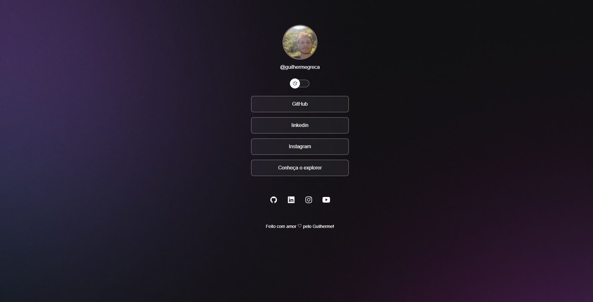

<h1 align="center">Projeto Links</h1>

  primeiro projeto pessoal aplicando conhecimentos adquiridos para a criação do meu portfolio.

  

Esse projeto foi desenvolvido com as seguintes tecnologias:

-HTML5 e CSS3  
-JavaScript  
-Git e Github  
-Figma

O Projeto Links é um agregador de links para usar como cartão de visitas online.

Você pode visualizar o layout do projeto através [DESSE LINK] (https://www.figma.com/file/dh0x1PfKtwPlScMquA323H/DevLinks-%E2%80%A2-Projeto-Discover-(Community)?type=design&node-id=0-1&t=JIawyBVIcXAWuH0F-0). É necessário ter conta no [Figma] (https://figma.com) para acessá-lo.

Projeto feito by Guilherme Nascimento Greca!
